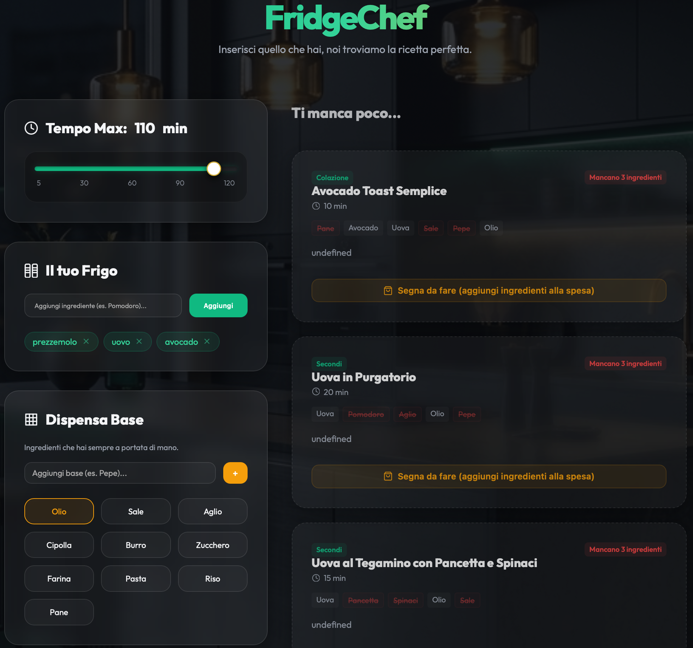
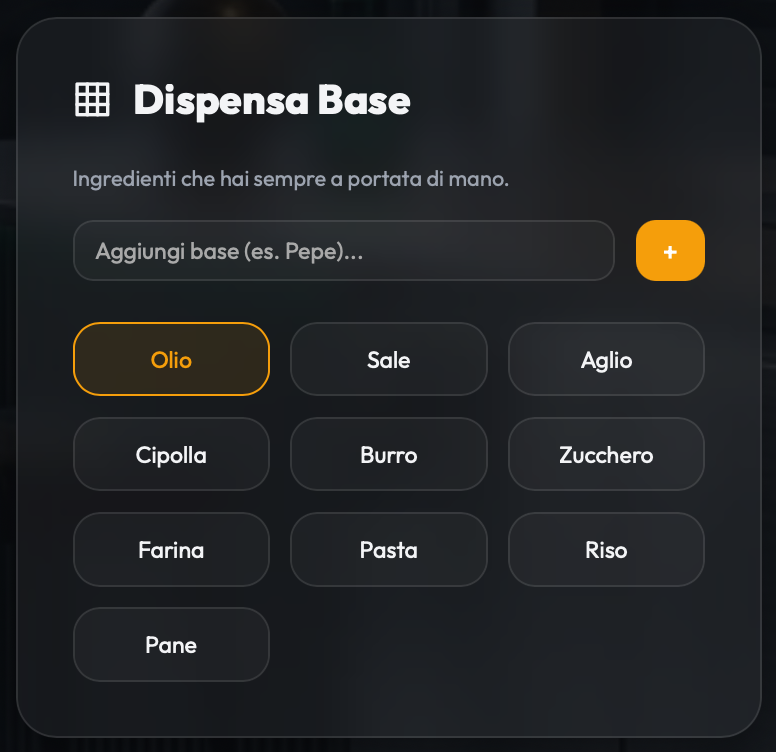
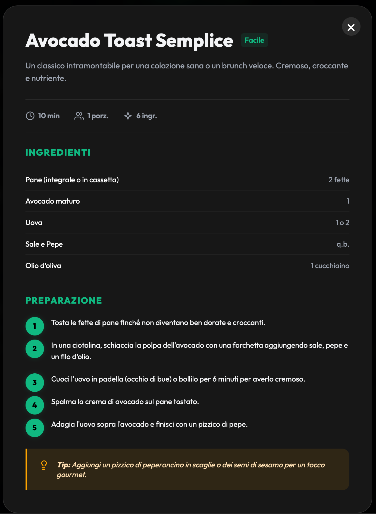
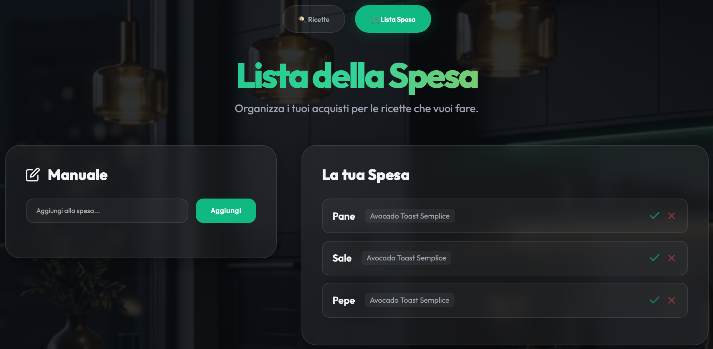

# 🍳 FridgeChef - Vibe Coding Edition

Benvenuti in **FridgeChef**, un'applicazione moderna e intuitiva progettata per trasformare gli ingredienti che hai già nel frigo in ricette gourmet.

Questo progetto non è solo un'app di cucina, ma è la prova tangibile del potere della **Generative AI** applicata allo sviluppo software.

## 🧠 La Storia del Progetto
Questa repository è stata creata durante una sessione di **"Vibe Coding"** dedicata a **Mia**. 
L'obiettivo era dimostrare come, oggi, sia possibile costruire software complesso e di alta qualità partendo da semplici idee e conversazioni naturali con l'IA.

Mia non è una persona tecnica — studia **Psicologia** — e questo progetto è nato per mostrarle come l'Intelligenza Artificiale possa abbattere le barriere tecnologiche, permettendo a chiunque di trasformare la propria creatività in realtà digitale, senza dover scrivere manualmente migliaia di righe di codice.

---

## 📸 Galleria (Screenshot)

| Sezione | Anteprima | Nome File |
| :--- | :--- | :--- |
| **Home Page** |  | `hero.png` |
| **Frigo & Dispensa** |  | `fridge_pantry.png` |
| **Dettaglio Ricetta** |  | `recipe_detail.png` |
| **Lista Spesa** |  | `shopping_list.png` |

---

## ✨ Caratteristiche Principali

- **🔍 Smart Matching**: L'app confronta gli ingredienti nel tuo frigo e nella tua dispensa con un database di oltre **250 ricette**.
- **⏱️ Gourmet Dial**: Un selettore di tempo ultra-rifinito che ti permette di filtrare i piatti in base a quanto tempo hai a disposizione.
- **🥫 Dispensa Personalizzabile**: Aggiungi i tuoi ingredienti di base (spezie, salse, condimenti) per avere un inventario sempre aggiornato.
- **🛒 Shopping List Intelligente**: Aggiungi gli ingredienti mancanti direttamente dalle ricette alla tua lista della spesa.
- **🎨 Design Premium**: Interfaccia in Dark Mode con effetto *Glassmorphism*, animazioni fluide e tipografia moderna (Outfit).

## 🛠️ Tech Stack

- **Core**: Vanilla JavaScript (ES6+), HTML5, CSS3 Moderno.
- **Tooling**: Vite per un'esperienza di sviluppo fulminea.
- **AI-Powered**: Sviluppato interamente tramite tecniche di Agentic Coding.

## 🚀 Come Iniziare

1.  Clona la repository.
2.  Installa le dipendenze:
    ```bash
    npm install
    ```
3.  Avvia il server di sviluppo:
    ```bash
    npm run dev
    ```
4.  Crea la cartella per gli screenshot (opzionale):
    ```bash
    mkdir -p docs/screenshots
    ```

---
Realizzato con ❤️ da Simo per Mia.
